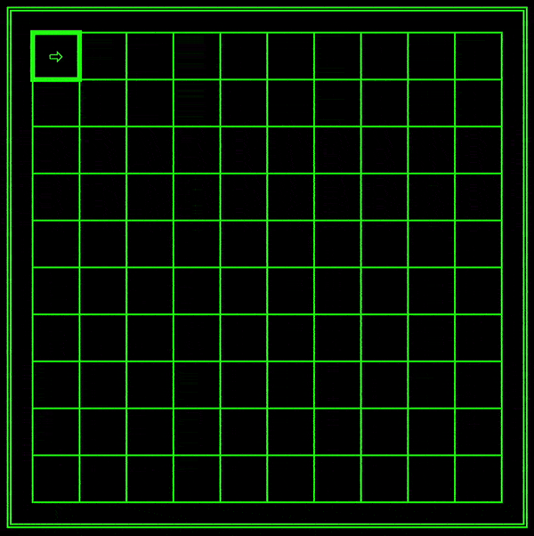

# Petit Robot



Petit Robot is an adorable robot that resides in a fascinating square world composed of 10 rows and 10 columns. This charming automaton can be programmed using its own programming language: Petit Language. Additionally, it features a wonderful tool called Petit Emulator, which allows for the generation of captivating animations that illustrate the program's execution.

## Petit Language

The Petit Language is remarkably simple as it lacks control structures and variables. It is based on two fundamental instructions: moving forward and turning clockwise. One notable aspect of this language is its peculiar structure, which will only allow you to give commands to the robot if you do so in a gentile manner.

### Examples

The following are simple examples of the Petit language syntax and the respective instructions that they generate in assembly language when compiled:

| Petit Language                                                                                                                                                                          | Assembly Language                                  |
|-----------------------------------------------------------------------------------------------------------------------------------------------------------------------------------------|----------------------------------------------------|
| Robot, please turn 90 degrees clockwise, then move 4 blocks ahead, and then turn 90 degrees clockwise.                                                                                  | TURN,90<br>MOV,4<br>TURN,90                        |
| Karel, kindly rotate 360 degrees clockwise.                                                                                                                                             | TURN,360                                           |
| Bot, <br>please turn 180 degrees clockwise,<br>afterwards walk 2 steps forward,<br>then turn 270 degrees clockwise,<br>then move 2 blocks ahead,<br>et then turn 360 degrees clockwise. | TURN,180<br>MOV,2<br>TURN,270<br>MOV,2<br>TURN,360 |

### Context Free Grammar
#### Lex
```
⟨VOCATIVE⟩ → Bot | Karel | Mecha | Petit | Robot
⟨COMMA⟩ → ,
⟨ADVERB_OF_MANNER⟩ → please | kindly

⟨VERB_OF_ROTATION⟩ → turn | rotate
⟨ONE_OF_FIRST_FOUR_POSITIVE_MULTIPLES_OF_90⟩ → 90 | 180 | 270 | 360
⟨ATOMIC_UNIT_OF_ANGLE⟩ → degrees
⟨ADVERB_OF_ROTATIONAL_SENSE⟩ → clockwise

⟨VERB_OF_MOTION⟩ → move | walk
⟨POSITIVE_INTEGER⟩ → ℕᐩ
⟨ATOMIC_UNIT_OF_LENGTH⟩ → blocks | steps
⟨ADVERB_OF_DIRECTION⟩ → forward | ahead

⟨CUMULATIVE_CONJUNCTION⟩ → and | et
⟨ADVERB_OF_TIME⟩ → then | next | subsequently | afterwards

⟨FULL_STOP⟩ → .
```

#### Yacc
```
⟨sentence⟩ → ⟨VOCATIVE⟩ ⟨COMMA⟩ ⟨ADVERB_OF_MANNER⟩ ⟨enumeration_of_instructions⟩ ⟨FULL_STOP⟩

⟨enumeration_of_instructions⟩ → ⟨instruction⟩
			      | ⟨instruction⟩ ⟨COMMA⟩ ⟨last_instruction_of_enumeration⟩
			      | ⟨instruction⟩ ⟨COMMA⟩ ⟨middle_instructions_of_enumeration⟩ ⟨last_instruction_of_enumeration⟩

⟨middle_instructions_of_enumeration⟩ → ⟨ADVERB_OF_TIME⟩ ⟨instruction⟩ ⟨COMMA⟩
			   	     | ⟨middle_instructions_of_enumeration⟩ ⟨ADVERB_OF_TIME⟩ ⟨instruction⟩ ⟨COMMA⟩

⟨last_instruction_of_enumeration⟩ → ⟨CUMULATIVE_CONJUNCTION⟩ ⟨ADVERB_OF_TIME⟩ ⟨instruction⟩

⟨instruction⟩ → ⟨rotation_instruction⟩
	      | ⟨motion_instruction⟩

⟨rotation_instruction⟩ → ⟨VERB_OF_ROTATION⟩ ⟨ONE_OF_FIRST_FOUR_POSITIVE_MULTIPLES_OF_90⟩ ⟨ATOMIC_UNIT_OF_ANGLE⟩ ⟨ADVERB_OF_ROTATIONAL_SENSE⟩

⟨motion_instruction⟩ → ⟨VERB_OF_MOTION⟩ ⟨length_parameter⟩ ⟨ATOMIC_UNIT_OF_LENGTH⟩ ⟨ADVERB_OF_DIRECTION⟩

⟨length_parameter⟩ → ⟨ONE_OF_FIRST_FOUR_POSITIVE_MULTIPLES_OF_90⟩
	           | ⟨POSITIVE_INTEGER⟩
```

## Petit Emulator

The Petit Emulator is a Python program that works as follows:

First, it reads a Petit Language code from "./input.txt". It then compiles it and saves the resulting assembled code to "./build/output.asm". It then reads this file line by line and performs the following actions for each line:

- Determines the type of instruction and fragments it into a series of atomic instructions equivalent to the original instruction. For example, the instruction MOV,3 is converted to three consecutive MOV instructions.

- For each generated atomic instruction, it is executed. In the case of MOV instructions, it is verified that the robot has not gone out of the world. If the robot is detected to have gone out of the world, an error message is displayed and program execution is terminated.

- Finally, the robot is rendered again in the world and printed on the console.

The operation of this emulator is described below with the help of a diagram:


### Messages

#### Compilation Error

When the emulator detects an instruction that could not be recognized by the Yacc parser, it will display the following error message to the user: ```[!] Invalid instruction!```

#### Execution Error

When a MOV instruction causes the robot to go beyond the boundaries of the world, the emulator will display the following error message to the user: ```[!] Robot has hit a wall!```

#### Completed Execution

When the execution of the program is successfully completed without encountering any errors, the emulator will display the following message to the user: ```[!] execution completed successfully!```. This message indicates that the program has finished executing all the instructions in the code and has reached its intended end state without any issues or errors. It serves as a confirmation that the program ran successfully and completed its intended tasks.

## Technologies Used
- Python
- Lex
- Yacc

## Authors 🖋
- [Carlos Amezcua](https://github.com/cdamezcua) - Developer
- [Daniel Muñoz](https://github.com/DanielMunoz4190) - Developer
- [Diego Curiel](https://github.com/DiegoCuriel) - Developer
